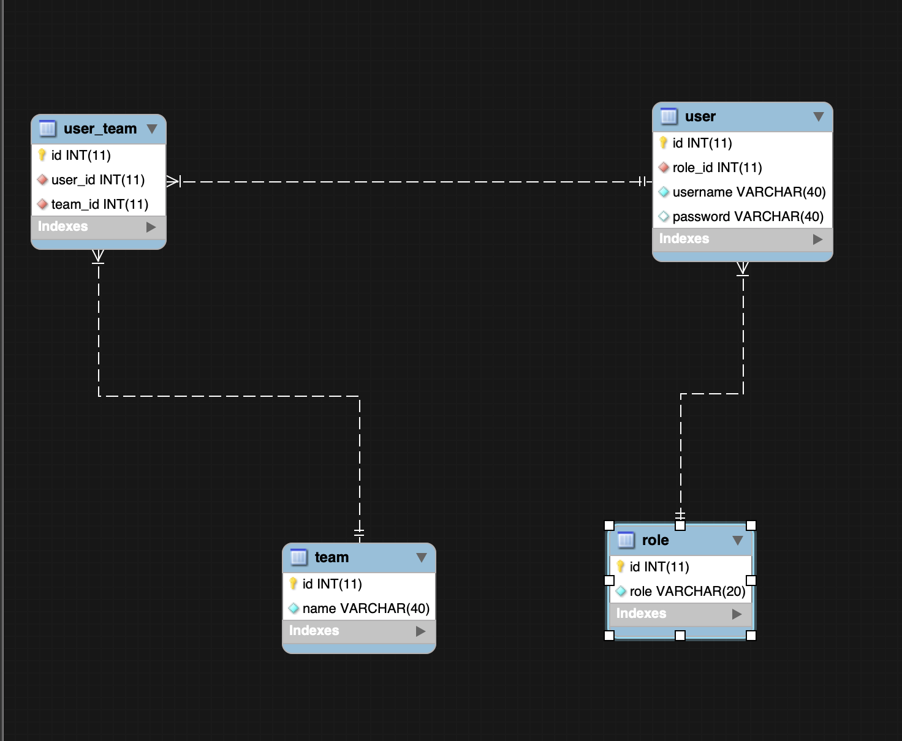

User Management
==============
This is a simple backend task for User management

# Installation

First, clone this repository:

```bash
$ git clone https://github.com/andela-sakande/user-manager.git
```
This project is bundled with docker for environment setup. The source code is in [Symfony](symfony) directory.

To run with docker if you have docker and docker-compose setup
 ```bash
 $ docker-compose up
 ```
 
add `symfony.localhost` in your `/etc/hosts` file.

You are done, you can visit your Symfony application on the following URL: `http://symfony.localhost:8080`

Execute the Docker Container for PHP and

- php bin/console doctrine:migrations:migrate
- php bin/console doctrine:fixtures:load  

## API features
- Get Token with `http://symfony.localhost:8080/api/login_check` with username and password admin, admin.
- Add the token with Authorization Header Bearer Token: (token from step 1 above)
- Create a user with `POST http://symfony.localhost:8080/admin` with [username, password, role]
- Delete a user with `DELETE http://symfony.localhost:8080/admin/{userid}`
- Create Team with `POST http://symfony.localhost:8080/team` with [name]
- Add User To a Team with `POST http://symfony.localhost:8080/team/{teamId}/user/{userId}`
- Delete a User from a team with `DELETE http://symfony.localhost:8080/team/{teamId}/user/{userId}`
- Delete team only if it does not have any user with `DELETE http://symfony.localhost:8080/team/{teamId}`


## API Documentation

Visit [Postman Online Documentation](https://documenter.getpostman.com/view/5708461/S11RLGAQ)

##DataBase Model



##Domain Model


##Things To Improve
- Set up Environment for Test including db
- Use a user provider for the jwt
- complete tests
- Perfect Domain Model diagram
